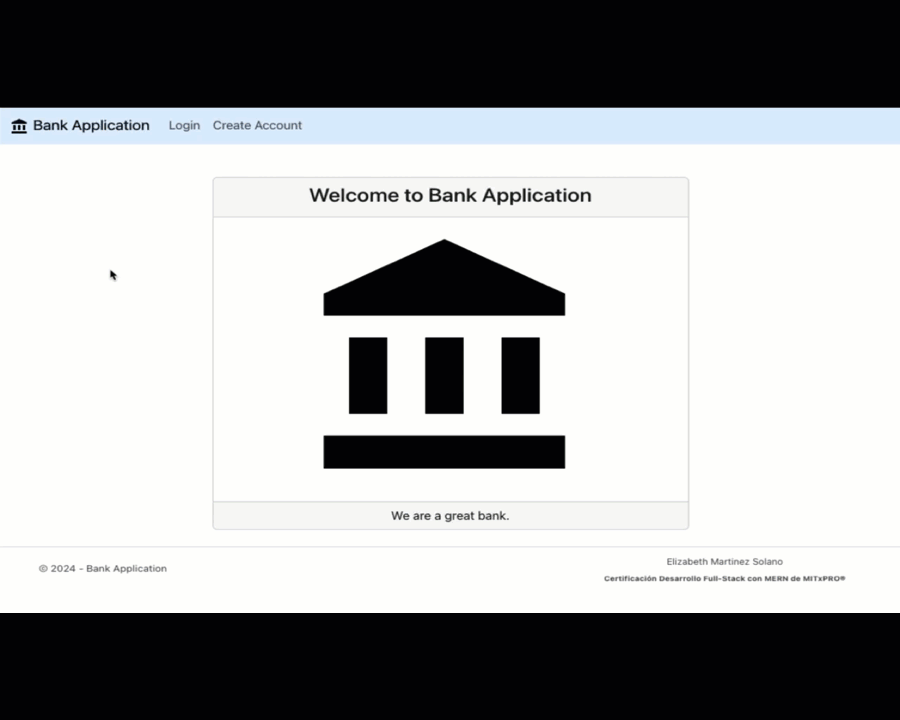

# Bank Application
<hr>
</img>

Con ésta aplicación pongo en práctica lo aprendido durante el programa de certificación
**Desarrollo Full-Stack con MERN de MITxPRO** y tiene como objetivo demostrar 
el dominio de los conocimientos necesarios para crear desde cero una aplicación en capas 
utilizando las tecnologías: MongoDB, Express, React y Node.JS para así ser acreedora a la certificación.


## Instalación

1.-Clonar repositorio:

```
git clone https://github.com/elizabeth011685/bank-application.git
cd bank-application
```

2.- Instalar dependencias del servidor:
```
cd server
npm install
```

3.-Iniciar servidor en modo desarrollo
```
npm start
```

4.- Instalar dependencias del cliente:
```
cd ../client
npm install
```
5.-Iniciar cliente en modo desarrollo
```
npm start
```

6.-Abrir la URL: [http://localhost:3000](http://localhost:3000) para ver la aplicación en tu explorador

## Capturas de Pantalla



## Tecnología Utilizada

- Cliente
  - React
  - Bootstrap
  - React Bootstrap
  - HTML
  - CSS
  - Axios
  - Formik
  - Firebase


- Servidor
  - Node.js
  - Express
  - MongoDB
  - Mongoose

## Características

- Inicio de Sesión
- Cierre de sesión
- Registro de Cuentas
- Registro de Depósitos
- Registro de Retiros
- Consulta de datos de todas las cuentas

## Características Adicionales

- Asignación de un número de cuenta random a cuentas recién creadas


## Licencia

[MIT LICENCE](https://github.com/elizabeth011685/bank-application?tab=MIT-1-ov-file#readme)